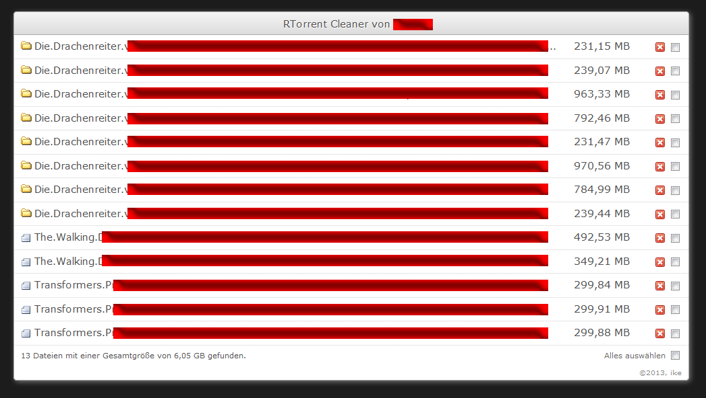

<h2 align="center">rTorrent cleaner</h2>

Lists unused files on disk.

## Setup

Copy contents of src folder to your rutorrent folder.

To access open https://serverip/cleaner.php in your browser.

## Screenshots

## Notes

This is the original script i released back in early 2013 on [netvision-technik.de](http://www.netvision-technik.de/forum/showthread.php?p=78813#post78813)

#### Tested with

- ruTorrent 3.5 
- rTorrent 0.89 - 0.93

## License

[MIT](https://choosealicense.com/licenses/mit/)
